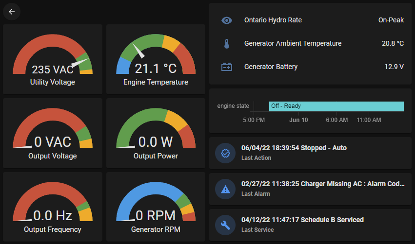
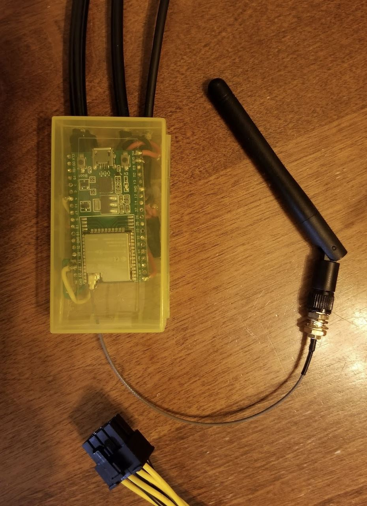

[ESP32](https://www.espressif.com/en/products/socs/esp32)-based bridge to connect to a [Genmon](https://github.com/jgyates/genmon)-supported standby generator.

The ESP32 is configured using [ESPHome](https://esphome.io/) and everything is ultimately linked to [Home Assistant](https://www.home-assistant.io/).

## Hardware

* ESP32-WROOM-32U devkit board
* External screw-on antenna
* 8-pin ATX EPS (CPU power) extension cable -- only need male end
* MAX3232 RS232<>TTL converter module
* Enclosure
* Wire, heat-shrink tubing, adhesive veclro strips

### Optional

Temperature sensors:

* 2x DS18B20 one-wire temperature sensor
* 1x 4.7k resistor

### ESP32

Normally Genmon is installed on a Raspberry Pi that is wired to the generator, but I decided to take a different approach and use a simple, cheap ESP32 as an RS232-wifi bridge, connecting back to Genmon running on a server inside the house.

1. Though the Pi can apparently work fine below its rated operating temperature of 0°C, the ESP32 is rated for –40°C to +125°C. 
2. The Pi is supposedly suspectiple to electromagnetic interference from the generator operating; my assumption is the ESP32, being much simpler, is less susceptible 
3. The ESP32 uses much less power, and unlike the Pi, can be powered entirely by the 5V supplied by the AUX port on the generator
4. The ESP32 is significantly smaller and along with all the above, is much easier to mount and connect

I specifically went with the ESP32-WROOM-32U devkit board -- which has an external antenna that sticks out the side of the generator -- to get a decent signal, as the generator's metal enclosure blocks wifi.

The case is attached with veclro adhesive strips to the inside side panel next to the wifi antenna, since the antenna cable is very short.

### Notes

* I initially built a prototype using a regular ESP32 with a PCB antenna; it had a Wifi signal around -85 dBm and around 25% packet loss. Switching to an external antenna raised the signal to -62 dBm and 0% packet loss. My generator is about 8' from the house (all lines are buried), and the nearest Wifi access point is about 20' but through a brick wall (which significantly lowers the 2.4GHz signal).
* I did all the wiring inline, which was OK at first but then I added the one-wire temperature sensors and ended up swapping the ESP32. If I did it over again I'd do the connections on a small perfboard with sockets to plug in the ESP32.
* I used some outdoor-rated Cat6 ethernet for the cable between the ESP32 and generator: doubling the brown+white/brown pairs for ground, orange+white/orange pairs for +5V, and blue and white/blue for TX and RX, respectively.

### Wiring

EPS connector:

* Pin 1: +5V ↔ ESP32 VCC in
* Pin 2: Ground
* Pin 7: RS232 TX ↔ MAX3232 RS232 Out
* Pin 8: RS232 RX ↔ MAX3232 RS232 In

MAX3232:

* RS232 Out ↔ EPS Pin 7
* RS232 In ↔ EPS Pin 8
* TTL In ↔ ESP32 TX (GPIO1)
* TTL Out ↔ ESP32 GPIO22
* Power + ↔ ESP32 3V3
* Power - ↔ Ground

> Note: I used GPIO22 instead of RX because I was having issues with receiving data which was a problem in my test setup, but I had changed the pin already. RX should work fine.

One-wire temperature:

* Each sensor:
  * VCC ↔ ESP32 3V3
  * Data ↔ ESP32 GPIO4
* 4.7k resistor between VCC and Data (only one)

All grounds need to be tied together.

## ESP32 Software

I chose [ESPHome](https://esphome.io/) because I was already using it for several other ESP32/ESP8266 devices, and it provides a lot of useful functionality out of the box.

This configuration uses:
* [UART Bus](https://esphome.io/components/uart.html)
* [Stream server for ESPHome](https://github.com/oxan/esphome-stream-server)
* [Dallas Temperature Sensor](https://esphome.io/components/sensor/dallas.html)

See [**esphome/generator.yaml**](esphome/generator.yaml) for the code.

## Genmon

### Install on Alpine Linux

I run genmon in an LXC container under [Proxmox](https://www.proxmox.com/), on Alpine 3.11

1. `apk add bash python3 sudo make gcc build-base libressl-dev python3-dev rust py3-pip`
2. `pip install -U pip` (needs v22+ for the python `cryptography` package)
3. `cd /opt && git clone https://github.com/jgyates/genmon.git && cd /opt/genmon`
4. `./genmonmaint.sh -i`
 
### Configuration

Start genmon, and in the UI, set:

* **Serial Server TCP/IP Address** = IP of the ESP32
* **Serial Server TCP/IP port** = `6638` (or whatever port the ESP32 stream server uses)

_This can also be done via `/etc/genmon/genmon.conf`_

Addons:

* Enable **MQTT** and configure server address
* **Blacklist Filter** = `Run Time,Monitor Time,Generator Time,Platform Stats,Communication Stats`
* **Flush Interval** = `60`
* **JSON for Numerics** = on

## Home Assistant

1. Add [**homeassistant/packages/generator.yaml**](homeassistant/packages/generator.yaml) to the [Home Assistant packages folder](https://www.home-assistant.io/docs/configuration/packages/) and restart Home Assistant
2. Add the contents of [**homeassistant/lovelace/generator-dashboard.yaml**](homeassistant/packages/generator-dashboard.yaml) to your [Home Assistant Dashboard](https://www.home-assistant.io/dashboards)

